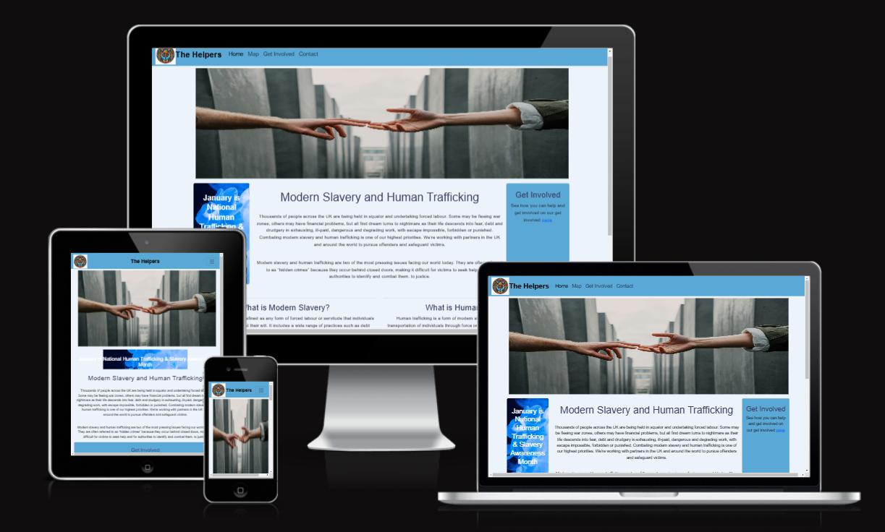

# 🫂✨ Code to protect! ⛓️‍💥🚨
## **🎄 National slavery and human trafficking prevention month hackathon**

# SUBMISSION

## **🚀Deployment**
* The platform is deployed using GitHub Pages, making it accessible globally without additional hosting costs.
* Continuous updates and improvements are made to enhance the user experience and security.

[Click this link to view the Website.](https://md-ash-dot.github.io/code-to-protect/) 

## **Criteria**

Our team addressed these applicable criteria:

- ✨ Project is 100% Front End
- ✨ Project must be based on reality, inspired by actual human trafficking prevention Webpages.
- ✨ Basic Readme.md in place

# **🧑‍💻 About the Submission**

## **Intro**
Modern slavery and human trafficking are grave human rights violations that affect millions of people worldwide. This platform is designed to provide individuals, activists, and organizations with crucial resources to combat these crimes. Our mission is to raise awareness, provide educational materials, and connect people in need with relevant support services.

## **Goal**
The Goal of this project is to provide a platform where the victims of slavery and human trafficking can reach out for help and advice, with a section for awareness. following the criteria set out by the hackathon facilitators and incorporating the hard work, skills and abilities of each team member while enjoying the process of learning to develop new and unique software.

This platform serves as:
- An Information Hub: Educating the public about modern slavery, its impact, and how to recognize signs.
- A Global Directory: Listing verified organizations across different regions that offer assistance and rehabilitation services.
- A Support System: A place where survivors and vulnerable individuals can reach out for immediate help and be directed to appropriate
  support networks.
- A Call to Action: Encouraging users to volunteer, donate, and report suspicious activities to help eradicate modern slavery.

## User Stories

* As a user, I want to be able to see the overall theme of the webpage from the welcome page.
* As a user, I want to see the organization info of countries on map.
* As a user, I should be able to see the contact us page so that I can fill the details to get support.
* As a user, I want to Seek Help and Support
    - Find emergency contacts and helplines relevant to my location.
    - Reach out anonymously to request assistance from verified organizations.
    - Get guidance on the next steps if I or someone I know is at risk.
* As a user, I want to Learn About Modern Slavery
    - Access easy-to-understand articles and reports explaining modern slavery and human trafficking.
    - Identify signs of trafficking and understand how to respond safely.
    - Read real survivor stories to gain insight into the reality of modern slavery.
* As a user, I want to Report Suspected Cases of Human Trafficking
    - Use an intuitive reporting form to provide necessary details confidentially.
    - Submit an anonymous tip about a suspicious situation.
    - Find the right authorities or NGOs to report concerns.
* As a user, I want to Find Organizations That Can Help
    - Browse a global directory of NGOs, law enforcement agencies, and support groups.
    - Filter organizations by region, services offered, and language support.
    - Contact organizations directly through provided channels.
* As a user, I want to Engage in Awareness and Advocacy
    - Join discussions and forums to share knowledge and experiences.
    - Sign petitions advocating for stronger anti-trafficking laws.
    - Volunteer or donate to organizations actively fighting modern slavery.
* As a user, I want to Use a Secure and Accessible Platform
    - Access content in multiple languages to ensure inclusivity.
    - Navigate an intuitive and mobile-friendly interface.
    - Ensure privacy and security while accessing sensitive information.

## Design 
### Colors
-  Incorporate a palette of four colors.

### Typography
- Basicly, sans-serif is the font used and cursive is the back-up font if sans-serif fails to load.

### Imagery
- Team Logo

## Wireframes

www.adobe.com/express/ 

- Adobe express is a cloud-based design and prototyping tool that is widely used for creating user interfaces (UI) and user experience
  (UX) designs.

## **💻 Tech Stack**
This platform is built using modern web technologies to ensure accessibility, responsiveness, and ease of use:
* HTML: For structuring the content of the website.
* CSS: For styling and visual enhancements.
* JavaScript: To enable dynamic interactivity and functionality.
* SVG: Used for scalable vector graphics to improve visual representation.
* Bootstrap: A front-end framework to ensure a mobile-friendly and responsive layout.

## Features
1. Global Organization Directory
- Users can browse and search for anti-trafficking organizations categorized by country and region.
- Detailed organization profiles include contact information, services offered, and links to external resources.

2. Help & Support Section
- A dedicated space where individuals at risk can request assistance.
- Provides emergency contact numbers, hotline services, and reporting options.
- Secure messaging system for those seeking confidential help.

3. Educational Resources
- Articles, reports, and videos on modern slavery and human trafficking.
- Case studies and survivor stories to raise awareness.
- Legal frameworks and policies from different countries.

4. Contact & Reporting Tools
- Easy-to-use reporting form for individuals who suspect human trafficking activities.
- Contact information for law enforcement and human rights organizations.
- Anonymous tip submission feature to protect whistleblowers.

5. Community Engagement & Advocacy
- Volunteer and donation opportunities to support anti-trafficking initiatives.
- Blog and discussion forums for activists and researchers.
- Petition campaigns to push for stronger laws and policies.

## Testing 
The testing was completed mainly through team members, which allowed us to identify various bugs that needed addressing.
To identify the source of bugs we used the developer Tools in various browsers (Console, Network, Performance tabs)

## Validation

1. W3C Markup Validator ( [Results](src/images/Home-validation-result.png) )
    - The main page (Index) has passed the validation test with no error.

1. W3C Markup Validator ( [Results](src/images/Involved-validation-result.png) )
    - The get_involved page  has passed the validation test with no error.

1. W3C Markup Validator ( [Results](src/images/Map-validation-result.png) )
    - The map page  has passed the validation test with no error.

1. W3C Markup Validator ( [Results](src/images/Contact-validation-result.png) )
    - The contact page  has passed the validation test with no error.

1. W3C Markup Validator ( [Results](src/images/Team-validation-result.png) )
    - The team page  has passed the validation test with no error.
    
1. W3C CSS Validator ( [Results](src/images/style-validation-result.png) )
    - The page has passed the validation test with no error.

1. Jshint javascript validator ([Results](src/images/JS-validation-result.png))
    - The page has passed the validation test with no error.

## Performance

The website performance was examined using the [Google Lighthouse](https://developers.google.com/web/tools/lighthouse/)

Click on [Results](src/images/Performance.png) to view the performance.

## **🌟 Credits**
The following articles played a main role in our project, they were our references to raise awaireness among victims and share meaningful information and contacts.
- [First to help you](https://www.first2helpyou.co.uk/raising-awareness-modern-slavery-and-human-trafficking/)
- [National Crime Agency](https://www.nationalcrimeagency.gov.uk/what-we-do/crime-threats/modern-slavery-and-human-trafficking)
- [Citizens advice](https://www.citizensadvice.org.uk/immigration/trafficking/report-human-trafficking/)
- [Modern slavery help line](https://www.modernslaveryhelpline.org/report)

# Team members

- **Many thanks to the team members for the hard work and cooperation.**

  - **Muhammed** - [GitHub](https://github.com/md-ash-dot), [LinkedIn](https://www.linkedin.com/in/muhammed-ashfaaq/)
  Scrum Master/ Development / Documentation
  - **Kristian** - [GitHub](https://github.com/KTC96), [LinkedIn](https://www.linkedin.com/in/kristian-cross-4976622b7/)
  Scrum Master/ Development / Documentationad
  - **Anthony** - [GitHub](https://github.com/anthonyjn08), [LinkedIn](www.linkedin.com/in/anthony-nelson8)
  Design/ Development / Documentation
  - **Louise** - [GitHub](https://github.com/Loudotcom), [LinkedIn](www.linkedin.com/in/louise-anderson-dev)
   Design/ Development / Documentation
  - **Prapti** - [GitHub](https://github.com/praptitambe), [LinkedIn](www.linkedin.com/in/prapti-tambe)
   Design/ Development / Documentation
  - **Nazek** - [GitHub](https://github.com/Nazek-Altayeb), [LinkedIn](https://www.linkedin.com/in/nazek-a-altayeb/)
   Design/ Development / Documentation

# Contribution
We actively encourage contributions from developers, researchers, and activists who wish to improve the platform. Here’s how you can contribute:
* Fork the repository on GitHub.
* Create a new branch with a descriptive name for your feature or bug fix.
* Make your improvements, ensuring adherence to coding best practices.
* Submit a pull request and describe the changes you’ve made.
* Our team will review the submission and merge approved contributions.

# Contact & Support

If you require assistance, want to suggest improvements, or need support, please reach out through the platform’s Contact section.
For emergency assistance, please use the Help & Support Section to find resources and hotlines specific to your region.
